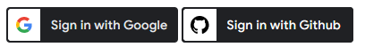

# symfony-oauth
Symfony OAuth2 Cliemt Bundle for fast integration of (yet only) Github and Google OAuth Service 

## Installation
add the custom repository to composer.json
```
"repositories": [
    {
        "type": "vcs",
        "url": "git@github.com:snoke/symfony-oauth.git"
    }
],
```
install
```composer req snoke/symfony-oauth```

## Configuration
edit ```config/packages/snoke_o_auth.yaml``` 
- set your **client-id** (aka api-key)
- set a redirect target **redirect_uri** after successful login
($token placeholder will be replaced automatically by the google auth token)

```yaml
snoke_o_auth:
  google:
    secret: '<your google client secret>'
    client_id: '<your google client-id>'
    redirect_uri: '<your redirect uri>/$token' # must containt $token which will be replaced by the actual token
  github:
    client_id: '<your github client-id >'
    redirect_uri: '<your redirect uri>' # token will be added as query parameter
```

## Usage
### frontend
add the following line to your twig template where you want the sign in button to appear
#### github:
```twig

```
#### google
```twig

```

## styling
styling is possible by twig variables:
```twig

```



following styling options are provied:
```
      theme: 'outline'        # outline|filled_blue|filled_black
      width: '120px'          # width
      locale: 'en_EN'	      # locale (only for google)
      type: 'standard' 	      # standard|icon
      size: 'medium' 	      # small|medium|large
      text: 'signin'	      # github: <your text> - google: signin|continue_with|signup_with|signin_with
      shape: 'rectangular'    # rectangular|pill|circle|square
      logo_alignment: 'left'  # left|center
```

### backend
decode the token using the GoogleService provided in this bundle
```php
use Snoke\OAuth\Services\GoogleService;

class AuthController extends AbstractController
{

    #[Route('/github_redirect_uri', name: 'app_githubcallback')]
    public function githubcallback(GithubService $githubService): Response
    {
        $claim = $githubService->getUser();
        $message = 'hello ' . $claim["name"]
        // ...
    }
    #[Route('/google_redirect_uri/{token}', name: 'auth_success')]
    public function success(GoogleService $googleService, string $token): Response
    {
        $claim = $googleService->getUser($token);
        $userEmail = $claim['email'];
        // ...
```
